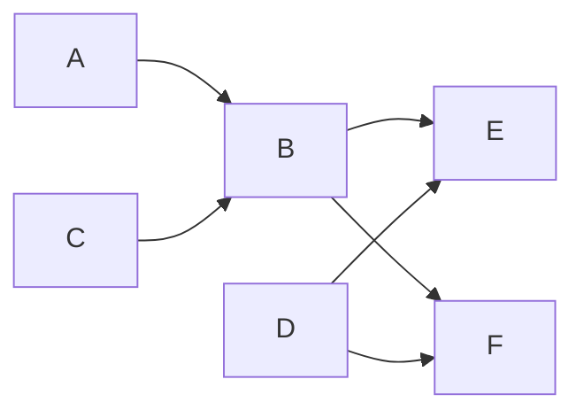
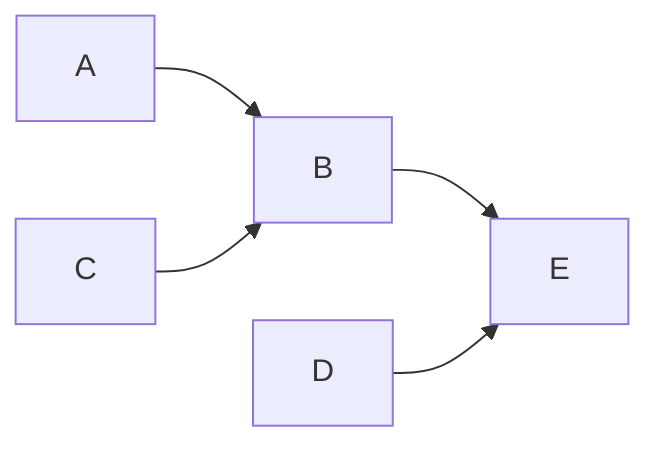

## Take Home - Full Stack

You are to build a visualization for a build system. Build systems are essentially DAGs - directred acyclic graphs.
Below is an example DAG. Note that parent to child relationships are many-to-many. Cycles are not possible.

A node has the following information within it: 
- `node_type`, one a 4 fixed types `TYPE_1`, `TYPE_2`, `TYPE_3`, `TYPE_4`
- `node_name` (unique and what is to be displayed in the graph) `A`, `B`, `C`, `D`, `E`, `F` etc
- `tags` a map of string to string 

## Problem

You are to build an application which can do the following
1. auto-complete search for nodes by node_name
2. upon selecting the node from autocomplete drop down, show the upstream dependencies of the node - as a graph
  - in the example above, selecting `E` should only show the relevant subgraph upstream of `E`

3. upon clicking the node in the graph, create a side bar on RHS and show the node information on the sidebar

## We are looking for 
1. Your ability to learn and apply unfamiliar technologies quickly.
   - use HTMX & Alpine to build an interactive site. 
   - mock any api calls you need to - use flask + python to serve dummy data on a port.
   - tailwind or any component library that you are familiar with is okay to use.
2. Your ability to build software that is both simple and capable.
